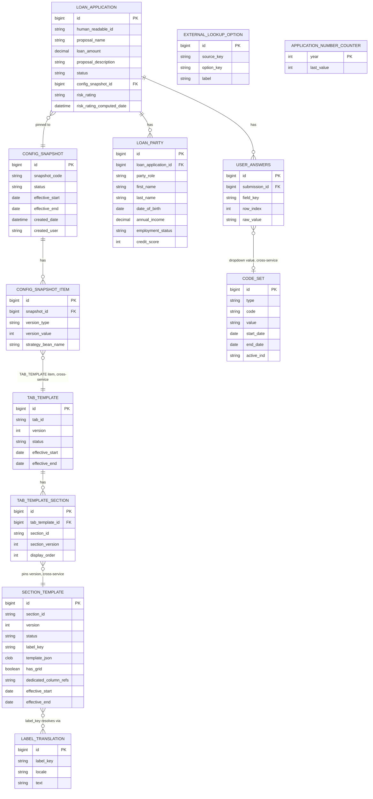

# Dynamic Questionnaire Engine — Architecture

This is the design record: what was decided, what the alternatives were, and why.
The companion document, **AI Agent Build Instructions**, is the leaner "build this,
in this order" doc for Claude Code — it references this one for rationale rather
than repeating it.

## Scale and intent

Target: **200+ questions across 5–6 sections**, enterprise-grade, not a throwaway
pattern. Driver: question text, labels, and business logic change often and must
be versioned without a redeploy. POC runs on H2; production runs on **pre-21c
Oracle** — every decision below accounts for that gap.

## The five components

| # | Component | Purpose |
|---|---|---|
| 1 | **questionnaire-service** | Authors, versions, and publishes section and tab templates. Never touches submitted answers. |
| 2 | **application-service** | Consumes published templates, runs a submission (the Loan Application), validates, persists via hybrid storage, computes risk rating. |
| 3 | **application-ui** (React) | Renders a tab of sections generically from whatever template JSON application-service returns. |
| 4 | **questionnaire-admin-ui** (React) | Lets business edit/publish templates. Lowest priority. |
| 5 | **lookup-stub-service** | Reference-data facade: a real mirror of the shared `code_set` table, plus a stub simulating genuinely external systems. |

---

## Decision 1 — how a section template is persisted

**Option A — fully normalized.** A table per concept (`field_definition`,
`dropdown_option`, `visibility_rule`, `validation_rule`), all FK'd back to
`section_template`. Publishing a version clones a row-tree.

**Option B — JSON blob per section version.** `section_template` holds only
identity/lifecycle columns plus one `template_json` column with the entire
field/rule/dropdown definition, matching the wire contract 1:1.

**Option C — hybrid.** Same as B, plus a few columns materialized purely for
query/validation speed: `has_grid` (boolean), `dedicated_column_refs` (text).

| | A | B | C |
|---|---|---|---|
| Publish = new version | Clone a row-tree | Insert one row | Insert one row |
| Query "sections using GRID" | Plain SQL | JSON scan | SQL on materialized columns |
| DEDICATED-field allowlist check | DB-assisted | App-code only | App-code, cheap downstream queries |
| Matches wire contract | No — assembly on read | Yes | Mostly |
| Build effort | Highest | Lowest | Medium |

**Decision: C.** A recursive, deeply nested structure (grids with conditional
rules with child fields) is exactly the shape relational modeling fights and
JSON documents handle naturally — A's complexity isn't unfamiliarity, it's a
real architectural mismatch for this shape. Pure B gives up cheap governance
queries that show up eventually at 200+ questions. **On pre-21c Oracle
specifically**, C matters more than it would on 21c+: there's no native `JSON`
type, only `JSON_VALUE`/`JSON_TABLE`/`JSON_EXISTS` over a CLOB with an `IS JSON`
check — more CPU per query, and a functional index only helps when a query
matches its exact expression — so materializing the two columns that get
queried constantly is worth the schema surface. Map `template_json` as a plain
CLOB/String in JPA (not a native-JSON-oriented type), so the mapping behaves
identically on H2 and pre-21c Oracle.

---

## Decision 2 — how a submission pins the versions of things that can change

Independently of section content versioning, a submission has to lock in
**which version of several different things** was in effect when it was
created: the tab template, the rating logic, and whatever versioned concern
gets added next. Two ways to model that:

**Option 1 — a per-loan pin table.** One row per submission per versioned
concern:

`SUBMISSION_VERSION_PIN(id, loan_application_id, version_type, pinned_version,
pinned_date)`, unique on `(loan_application_id, version_type)`.

Pros: no coordination between teams — a template change and a rating-logic
change publish independently, each just inserts its own pin going forward.
Cons: **no guarantee the combination that ends up pinned to any given loan was
ever tested together** — tab v3 could end up paired with rating-logic v1 purely
by accident of publish timing, with nobody having deliberately released that
combination. Row growth is *not* a real problem at any realistic scale (a
million loans × a dozen version types is still a narrow, well-indexed 12
million rows) — that's not the reason to avoid this option.

**Option 2 — a config snapshot / bundle table.**

`CONFIG_SNAPSHOT(id, snapshot_code, status [DRAFT/ACTIVE/RETIRED],
effective_start, effective_end, created_date, created_user)` — exactly one
`ACTIVE` snapshot at a time; that's what new loans pin to.

`CONFIG_SNAPSHOT_ITEM(id, snapshot_id FK, version_type, version_value,
strategy_bean_name nullable)` — one row per versioned concern per snapshot.

`LOAN_APPLICATION` carries **one** column, `config_snapshot_id`, instead of a
column — or a pin-table row — per concern.

**Decision: Option 2 (snapshot).** The real justification isn't row count,
it's **coherence**: every versioned concern moves together as one deliberate,
auditable, testable release, so "what version is this loan running" is always
answerable as a single unit, and every combination that's ever pinned to a
loan is a combination someone actually published on purpose. The honest
trade-off is a coordination point — if different teams own different concerns
on different cadences, someone has to decide when to cut a new snapshot.

**Mitigation that makes this scale past a handful of version types:**
publishing a snapshot is a **clone-forward** operation, not a manual assembly
— copy every item from the current `ACTIVE` snapshot into a new `DRAFT`
snapshot, override only the item(s) that actually changed, then activate
atomically (old → `RETIRED`, new → `ACTIVE`). A template team publishing a
section change never has to talk to the rating-logic owner; their publish
action clones the rating-logic pointer forward untouched. Coordination is only
required when two teams try to change the same `version_type` in the same
publish window — which is rare and should require a conversation.

Adding a brand-new versioned concern later (a workflow-stage version, a
notification-template version) is: pick a new `version_type` string, no
schema change, no migration.

---

## Decision 3 — how business logic dispatches by version, without if/else

The naive approach — a `switch` on version number inside one big rating
method — doesn't scale as versions accumulate and makes every new version a
diff to existing, working code.

**Mechanism:** each version of a piece of versioned business logic (e.g. risk
rating) is its own Spring `@Component`, implementing a shared interface:

```
interface RiskRatingStrategy {
    RiskLevel rate(LoanApplication header, Map<String, String> answers);
}
```

Spring auto-populates `Map<String, RiskRatingStrategy>` keyed by **bean name**
when you inject it — no registry-building code required. Combined with
Decision 2: `CONFIG_SNAPSHOT_ITEM.strategy_bean_name` for the `RATING_LOGIC`
row holds the bean name directly (e.g. `"ratingV2"`). Dispatch becomes:

```
strategyMap.get(snapshotItem.getStrategyBeanName()).rate(header, answers)
```

**Adding a new version = adding one new `@Component` class file.** Zero
existing code touched — not even a map-builder, because Spring builds the map
from classpath scanning. If a new snapshot's logic is actually unchanged from
a prior version, its item can simply repoint to the same bean name — version
number and implementation are decoupled.

**What this does and doesn't buy you, honestly:** this eliminates code
branching and makes adding a version a pure addition — but it still requires
a code deploy to add a new version, because the version *is* a Java class.
That's the right-sized answer for "changing logic version, in-progress stays
on old version." If the goal ever becomes "business user edits rating logic
without a deploy," that's a materially different and bigger tool (a rules
engine, or scripted expressions evaluated at runtime) — out of scope here.

---

## Decision 4 — dropdown sourcing

Three source types, one client interface so the hydration engine never
branches on where a dropdown came from:

- **STATIC** — options baked into `template_json`.
- **CODE_SET** — `{code_set_type}` param, resolved against lookup-stub-service's
  `code_set` mirror. `code_set` already carries its own versioning mechanism —
  `start_date`/`end_date`/`active_ind` — deliberately **not** unified with the
  Decision 2 snapshot mechanism, because it's a fundamentally different job:
  code_set is continuously effective-dated reference data ("what was active on
  date X"), snapshots are discrete, deliberately-published releases ("which
  exact bundle was this loan pinned to"). Forcing one mechanism to do both
  would be worse at both jobs.
- **EXTERNAL** — `{sourceKey}` param, resolved against lookup-stub-service's
  external-system simulation.

Whether reopening a draft re-fetches live option values or uses what was
cached at draft-creation time is a per-field policy decision, resolved in
`/docs/decisions.md` during the build (see the AI Agent Build Instructions).

---

## Decision 5 — tab vs. section versioning are independent axes

A `TAB_TEMPLATE` (payload: ordered `{section_id, pinned_section_version}`
pairs) versions independently of the `SECTION_TEMPLATE`s it references.
Reordering sections, renaming a section, or adding/removing a section bumps
the tab version even if no field inside any section changed; changing a
question's label or adding a field bumps only that section's version. A
submission's `CONFIG_SNAPSHOT` pins both, transitively.

---

## Decision 6 — no dynamic SQL from unvalidated metadata

A DEDICATED field's `dedicated_table_name`/`dedicated_column_name` must be
validated against an allowlist derived from application-service's real JPA
entity model at **publish time**, never interpolated into a query string at
read/write time. This is a hard requirement, not a style preference — the
original architecture sketch's `String.format("SELECT %s FROM %s ...")`
pattern is a SQL-injection surface the moment template metadata isn't fully
trusted (e.g. once the admin UI exists).

---

## Decision 7 — conditional rule scope

Every `visibility_rule` and `validation_rule` carries an explicit `scope`:
`SECTION`, `ROW` (for grid rows), or `TAB` (cross-section). One rule-engine
code path handles all three — no grid-specific special casing. This is what
lets a grid row's visibility and a plain field's visibility share the exact
same evaluator.

---

## Decision 8 — write model vs. read/report model

`USER_ANSWERS` (EAV) is the write/transactional model. It is explicitly *not*
assumed to also be the query model for reporting ("find all loans where
question 47 = X") — that's a read-side projection to design later if needed,
not a rewrite of the write path. Flagged so nobody backs into using EAV as a
reporting table by default.

---

## Decision 9 — i18n

Labels are stored as translation keys (`label_key`) resolved through a
`LABEL_TRANSLATION(label_key, locale, text)` table, even though the POC only
renders one locale. Retrofitting i18n after hardcoding strings is expensive;
designing for it from day one is nearly free.

---

## Consolidated non-functional requirements

1. No dynamic SQL from template metadata (Decision 6).
2. Rule scope must be explicit and shared across section/row/tab (Decision 7).
3. Write and read models are allowed to diverge (Decision 8).
4. Dropdown snapshot-vs-live policy is decided per field, not assumed.
5. Version/strategy lookups are O(1) map lookups, never a linear scan.
6. Labels are i18n-ready from day one (Decision 9).
7. Mid-flight template/snapshot changes: an in-progress submission stays
   pinned to the `CONFIG_SNAPSHOT` it was created under until resubmission —
   never silently migrated.
8. `section_template` uses Option C storage (Decision 1); `template_json` maps
   as CLOB/String, not a native-JSON JPA type, for H2/Oracle parity.
9. Versioned concerns are bundled into `CONFIG_SNAPSHOT`s, published via
   clone-forward (Decision 2), never as ad hoc per-loan pins or growing
   columns on `LOAN_APPLICATION`.
10. Versioned business logic dispatches via bean-name lookup in a
    Spring-populated map (Decision 3), never `if`/`switch` on version number.

---

## Worked example — Loan Application domain (Proposal tab)

### Key Information section — mixes DEDICATED and EAV fields

| Field | Type | Storage | Dropdown source |
|---|---|---|---|
| proposal_name | text | DEDICATED → `loan_application.proposal_name` | — |
| loan_amount | number | DEDICATED → `loan_application.loan_amount` | — |
| proposal_description | textarea | DEDICATED → `loan_application.proposal_description` | — |
| has_existing_relationship | radio (Yes/No) | EAV | — |
| existing_relationship_id | text | EAV | — |

**Demo 1 — conditional visibility:** `existing_relationship_id` visible only
when `has_existing_relationship = Yes`, scope `SECTION`.

### Additional Information section — the "loan questionnaire" (EAV)

| Field | Type | Dropdown source |
|---|---|---|
| loan_purpose | dropdown | CODE_SET `LOAN_PURPOSE` |
| loan_term_months | number | — |
| repayment_frequency | dropdown | CODE_SET `REPAYMENT_FREQ` |
| interest_rate_type | dropdown | CODE_SET `INTEREST_RATE_TYPE` |
| rate_cap_percentage | number | — |
| requires_collateral | radio (Yes/No) | — |
| additional_comments | textarea/commentary | — |

**Demo 2 — conditional validation:** `rate_cap_percentage` always visible,
`required` only when `interest_rate_type = VARIABLE`, scope `SECTION` —
deliberately a different mechanism from Demo 1 (field stays rendered, only
mandatory-ness changes).

### Associated Records section — "Collateral Properties" grid (EAV, repeatable)

| Field | Type | Dropdown source |
|---|---|---|
| property_address | text | — |
| property_type | dropdown | CODE_SET `PROPERTY_TYPE` |
| estimated_value | number | — |
| lien_position | dropdown | CODE_SET `LIEN_POSITION` |
| notes | textarea | — |

### LoanApplication (header, application-service, dedicated)

| Column | Notes |
|---|---|
| id | PK |
| human_readable_id | `L{year}-{sequence}`, resets yearly, no padding |
| proposal_name, loan_amount, proposal_description | Key Information DEDICATED fields |
| status | `DRAFT` on creation |
| config_snapshot_id | FK → `CONFIG_SNAPSHOT` — the single pinned-version reference (Decision 2) |
| risk_rating | nullable until computed — `HIGH`/`MEDIUM`/`LOW` |
| risk_rating_computed_date | nullable |
| created_date, created_user, modified_date, modified_user | audit |

`application_number_counter(year, last_value)` is the atomic counter behind
`human_readable_id` — incremented in the same transaction as the insert, not
a real FK relationship.

### LoanParty (borrower/co-borrower — dedicated, one role-discriminated table)

| Column | Notes |
|---|---|
| id | PK |
| loan_application_id | FK |
| party_role | `BORROWER` / `CO_BORROWER` |
| first_name, last_name, date_of_birth | |
| annual_income, employment_status, credit_score | |
| audit columns | |

### Risk rating engine

- `RiskRatingStrategy` per version, dispatched via `CONFIG_SNAPSHOT_ITEM
  (version_type='RATING_LOGIC').strategy_bean_name` (Decision 3).
- Computed live — every `save-draft` call recomputes and returns the current
  rating against the answers so far and the loan's pinned snapshot. Submit
  does one final authoritative computation the same way.
- **Demo 3 — business logic on a field's value:** v1's strategy bases the
  rating on `loan_amount` thresholds, then bumps the computed tier up one
  level if `requires_collateral = No`. This lives in Java code, not a
  template rule — proving the rule engine and the business-logic layer are
  genuinely separate systems.

---

## ERD

Tables by module:

- **questionnaire-service**: `TAB_TEMPLATE`, `TAB_TEMPLATE_SECTION`,
  `SECTION_TEMPLATE`, `LABEL_TRANSLATION`.
- **lookup-stub-service**: `CODE_SET`, `EXTERNAL_LOOKUP_OPTION`.
- **application-service**: `LOAN_APPLICATION`, `APPLICATION_NUMBER_COUNTER`,
  `LOAN_PARTY`, `USER_ANSWERS`, `CONFIG_SNAPSHOT`, `CONFIG_SNAPSHOT_ITEM`.

All cross-module references (`LOAN_APPLICATION.config_snapshot_id` pointing at
concerns that ultimately resolve to `TAB_TEMPLATE`/`SECTION_TEMPLATE`
versions; `USER_ANSWERS` values referencing `CODE_SET` codes) are **logical
references resolved over REST, not DB-enforced foreign keys** — these are
separate schemas today (separate H2 files) and separate Oracle schemas in
production. Within a module, all FKs are real. `APPLICATION_NUMBER_COUNTER` is
intentionally unconnected below — it's not a foreign-key relationship, just a
counter `LOAN_APPLICATION` creation logic reads and increments.



